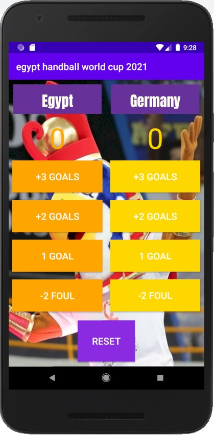
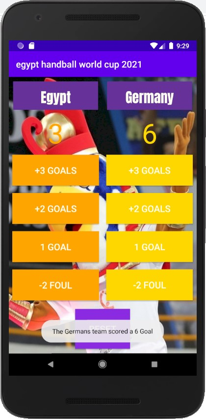
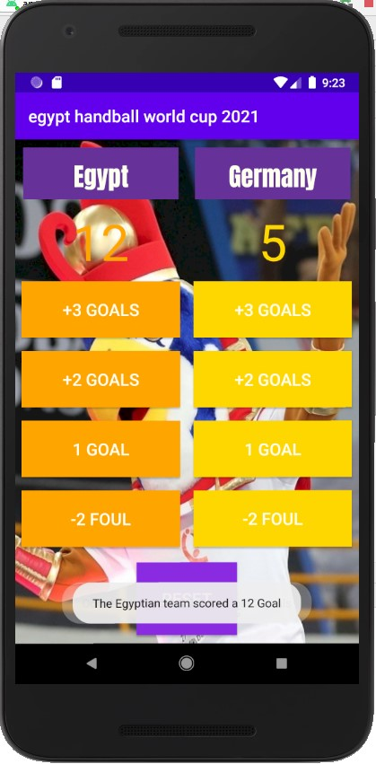
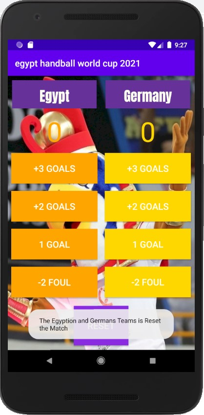

# Egypt-cup-2021-App

### This project simulates a handball match between Egypt and Germany, and there are buttons to score goals, buttons to decrease goals, and a button to replay the match from the first and display the goals of both teams

# 1- In Xml files:

## A- activity_main.xml:
#### 1 RelativeLayout
#### 3 LinearLayout
#### 4 TextView
#### 9 Button

## B- strings.xml:
#### 10 Strings I added them

## C- colors.xml:
#### 9 Colors I added them

# 2- In Java files:

## A- Variables:
### There are 4 Variables I made them
#### 1- integer variable to store Egypt Team scores
#### 2- integer variable to store Germany Team scores
#### 3- I used MediaPlayer library to store a voiceover when the Egyptian team wins
#### 4- I used MediaPlayer library to store a voiceover when the Germany team wins

## B- Methods:
### There are 11 Methods I made them
#### 1- I created two methods called displayForTeamA and displayForTeamB to display the user clicks that will come from the rest of the ways to store the decrease and increase Scores Methods It also includes if/else conditional statements With it, when each team scores 10 goals or more, play an audio file commenting on the victory of the team that scored 10 goals or more.
#### 2- The addOneForTeamA and addOneForTeamB methods: It increases the scores for Egyption or German Team by One per click because it is linked to the onClick method
#### 3- The addTwoForTeamA and addTwoForTeamB methods: It increases the scores for Egyption or German Team by Two per click because it is linked to the onClick method
#### 4- The addThreeForTeamA and addThreeForTeamB methods: It increases the scores for Egyption or German Team by Three per click because it is linked to the onClick method
#### 5- The FoulA and FoulB methods: It decreases both teams by 2 scores when the user presses the button
#### 6- The ResetBtn method: Button returns scoring the Egyptian and German teams to 0 scores As if the application replays the game from the first and new

# Photos for stages app:

#### Stage 1:

#### Stage 2:

#### Stage 3:

#### Stage 4:

